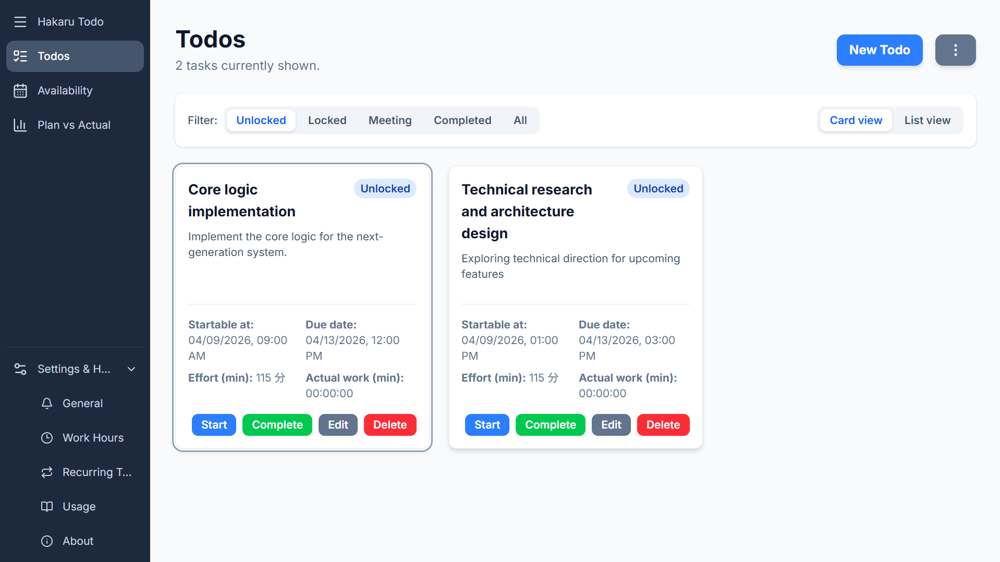

# Hakaru Todo

A To-Do app that lets you see exactly what you can start on at a glance.
Since data is stored locally in your browser (IndexedDB, LocalStorage), no network communication occurs.

## Differences from typical Todo apps

Only tasks that can be started (Unlocked) are displayed.
Tasks that cannot be started (Locked) are those that meet the following criteria.

- Tasks that have prerequisites that are not yet completed
- Tasks that have a start date in the future

The displayed tasks are sorted by their due dates, making it easy to see which tasks should be prioritized.
Additionally, tasks that have passed their start date minus the estimated effort are highlighted in yellow, making it easy to identify overdue tasks.

### Screenshots



### Build this project

#### Get the source

```bash
git clone https://github.com/nimzo6689/hakaru-todo.git
cd hakaru-todo
```

#### Prerequisites

- Install pnpm: `npm install -g pnpm`
- Run `pnpm install`

#### Launch the application

- Run `pnpm dev`

#### Build the application

- Run `pnpm build`

#### Preview the production build

- Run `pnpm preview`

### Contribute to this project

Pull requests are most welcome!
Please target the `main` branch and run `pnpm build` (or at least `pnpm lint`) to ensure your changes compile and match the code guidelines.
